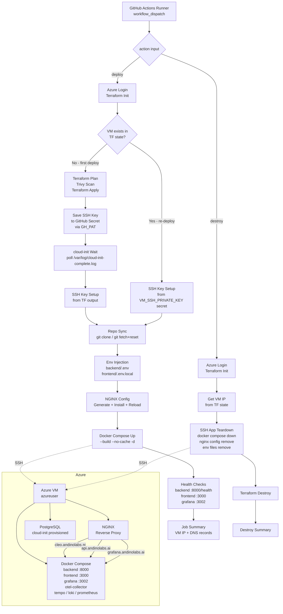

# Design Document: vm-deployment-cicd

## Overview

This feature delivers a single GitHub Actions workflow file (`.github/workflows/deploy.yml`) that replaces the existing `terraform.yml`. The unified workflow handles the complete lifecycle of the CLEO application stack on Azure: infrastructure provisioning via Terraform, application deployment via Docker Compose and NGINX, and full teardown — all triggered manually via `workflow_dispatch`.

The workflow is idempotent by design. On first run it provisions the Azure VM, waits for cloud-init, and saves the generated SSH key as a GitHub secret for future runs. On subsequent runs it detects the existing VM via Terraform state and skips infrastructure provisioning, going straight to application deployment.

### Key Design Decisions

- **Single workflow file**: Reduces operational complexity. One file to understand, one file to trigger.
- **Idempotent deploy**: VM existence is checked via `terraform output` before any `plan`/`apply`. Re-deploys are fast and safe.
- **Auto-saved SSH key**: After first provision, the Terraform-generated SSH key is encrypted with libsodium and stored as `VM_SSH_PRIVATE_KEY` via the GitHub REST API using `GH_PAT`. No manual key management required.
- **Fail-fast validation**: JSON inputs are validated with `jq` before any remote operations, preventing wasted time on invalid configurations.
- **Graceful destroy**: SSH teardown failures during destroy are treated as warnings, not errors — the VM may already be gone, and `terraform destroy` should still run.

---

## Architecture



---

## Components and Interfaces

### Workflow Inputs

| Input | Type | Default | Description |
|---|---|---|---|
| `action` | choice | — | `deploy` or `destroy` |
| `deploy_target` | choice | `all` | `all` / `backend` / `frontend` |
| `backend_version` | string | `latest` | Backend image version tag |
| `frontend_version` | string | `latest` | Frontend image version tag |
| `backend_env` | string | — | JSON object of backend env vars (always required on deploy) |
| `frontend_env` | string | — | JSON object of frontend env vars (always required on deploy) |
| `frontend_domain` | string | `cleo.andinolabs.ai` | Frontend subdomain (used on `deploy_target=all` only) |
| `backend_domain` | string | `api.andinolabs.ai` | Backend subdomain (used on `deploy_target=all` only) |
| `grafana_domain` | string | `grafana.andinolabs.ai` | Grafana subdomain (used on `deploy_target=all` only) |

### GitHub Secrets

| Secret | Set by | Purpose |
|---|---|---|
| `AZURE_CREDENTIALS` | Team (existing) | Azure login + Terraform authentication |
| `POSTGRES_PASSWORD` | Team (existing) | Passed as `TF_VAR_postgres_password` |
| `GH_PAT` | Team (once, manually) | GitHub API `secrets:write` for saving `VM_SSH_PRIVATE_KEY` |
| `VM_SSH_PRIVATE_KEY` | Pipeline (auto, first deploy) | SSH access for re-deploys and destroy |

### External Integrations

- **Azure CLI / `azure/login@v2`**: Authenticates the runner with Azure using the service principal in `AZURE_CREDENTIALS`.
- **Terraform (`hashicorp/setup-terraform@v3`)**: Manages infrastructure in `terraform/env/dev` against the Azure Storage backend (`vanguardtfstate` / `tfstate` / `vanguard.terraform.tfstate`).
- **Trivy**: Security scans the Terraform plan JSON for HIGH/CRITICAL findings before first-time apply.
- **GitHub REST API**: `PUT /repos/{owner}/{repo}/actions/secrets/VM_SSH_PRIVATE_KEY` — called with `GH_PAT` to persist the SSH key after first provision.
- **SSH**: All VM operations (repo sync, env injection, NGINX config, Docker Compose) are executed via SSH as `azureuser`.

### File Structure

```
.github/
  workflows/
    deploy.yml                    ← unified workflow (replaces terraform.yml)
terraform/
  env/dev/                        ← existing, unchanged
docker-compose.observability.yml  ← updated with BACKEND_VERSION / FRONTEND_VERSION vars
```

---

## Data Models

### VM Existence State

The pipeline determines deploy path based on Terraform state output:

```
VM_EXISTS = (terraform output -raw vm_public_ip) != ""
VM_IP     = terraform output -raw vm_public_ip
```

- `VM_EXISTS=false` → first-deploy path (provision + cloud-init wait)
- `VM_EXISTS=true` → re-deploy path (skip to SSH steps)

### SSH Key Lifecycle

```
First deploy:
  ssh_private_key ← terraform output -raw ssh_private_key
  → masked via ::add-mask::
  → written to /tmp/vm_key.pem (chmod 600) on runner
  → encrypted with repo public key (libsodium XSalsa20-Poly1305)
  → stored as VM_SSH_PRIVATE_KEY via GitHub API

Re-deploy / Destroy:
  VM_SSH_PRIVATE_KEY secret → /tmp/vm_key.pem (chmod 600) on runner
```

### Environment File Format

Input JSON is transformed to KEY=VALUE format via `jq`:

```bash
# Input (workflow input):
{"KEY1": "value1", "KEY2": "value2"}

# Transformation:
echo '${{ inputs.backend_env }}' | jq -r 'to_entries[] | "\(.key)=\(.value)"'

# Output written to VM at ~/cleo/backend/.env:
KEY1=value1
KEY2=value2
```

### NGINX Configuration Model

Generated on the runner from workflow inputs, then transferred to VM:

```
/etc/nginx/sites-available/cleo  ← generated config
/etc/nginx/sites-enabled/cleo    ← symlink to above
```

Three server blocks, one per domain:
- `frontend_domain` → `proxy_pass http://localhost:3000` (with WebSocket headers)
- `backend_domain` → `proxy_pass http://localhost:8000` (with WebSocket headers + `proxy_buffering off`)
- `grafana_domain` → `proxy_pass http://localhost:3002`

### Deploy Target Logic

```
deploy_target=all         → full stack up, NGINX reconfigured, all health checks
deploy_target=backend     → env files updated, backend rebuilt only, backend health check
deploy_target=frontend    → env files updated, frontend rebuilt only, frontend health check
```

Observability stack (otel-collector, tempo, loki, prometheus, grafana) is always managed via `docker-compose.observability.yml` directly — its config lives in the compose file and `observability/` config files, not in pipeline inputs. It starts as part of `deploy_target=all` and is not individually targetable from the workflow.

First deploy guard: if `deploy_target != all` and VM does not exist, fail immediately with:
```
Error: deploy_target must be 'all' for the first deploy. VM does not exist yet.
```

### Docker Compose Target Commands

```bash
# all — brings up everything including observability stack
BACKEND_VERSION=v1.2.0 FRONTEND_VERSION=v1.3.0 \
docker compose -f docker-compose.observability.yml up --build --no-cache -d

# backend only
BACKEND_VERSION=v1.2.0 FRONTEND_VERSION=v1.3.0 \
docker compose -f docker-compose.observability.yml up --build --no-cache -d backend

# frontend only
BACKEND_VERSION=v1.2.0 FRONTEND_VERSION=v1.3.0 \
docker compose -f docker-compose.observability.yml up --build --no-cache -d frontend
```

### Docker Compose Version Variables

The `docker-compose.observability.yml` file uses environment variable substitution for image versioning:

```yaml
backend:
  build:
    context: ./backend
  image: cleo-backend:${BACKEND_VERSION:-latest}

frontend:
  build:
    context: ./frontend
  image: cleo-frontend:${FRONTEND_VERSION:-latest}
```

### Job Summary Format

```markdown
## Deployment Summary

Action:           deploy
Deploy Target:    <deploy_target>
VM Public IP:     <ip>
Backend Version:  <backend_version>
Frontend Version: <frontend_version>

DNS Records (create if not already set):
cleo.andinolabs.ai    → <ip>
api.andinolabs.ai     → <ip>
grafana.andinolabs.ai → <ip>
```

---

## Correctness Properties

*A property is a characteristic or behavior that should hold true across all valid executions of a system — essentially, a formal statement about what the system should do. Properties serve as the bridge between human-readable specifications and machine-verifiable correctness guarantees.*

### Property 1: Invalid JSON inputs are rejected before remote operations

*For any* `backend_env` or `frontend_env` string that is not valid JSON, the pipeline validation step should fail with a non-zero exit code and a descriptive error message, and no SSH or Terraform commands should have been executed.

**Validates: Requirements 1.10**

---

### Property 2: VM existence check determines deploy path

*For any* Terraform state, if `terraform output -raw vm_public_ip` returns a non-empty string, the pipeline should skip `terraform plan`, `trivy scan`, and `terraform apply`; if it returns empty or errors, the pipeline should execute all three provisioning steps.

**Validates: Requirements 3.2, 3.3, 3.4**

---

### Property 3: SSH key is always cleaned up from runner

*For any* deploy or destroy job outcome (success or failure), the temporary file `/tmp/vm_key.pem` should not exist on the runner after the job completes.

**Validates: Requirements 5.4**

---

### Property 4: JSON env inputs round-trip to KEY=VALUE format

*For any* valid JSON object passed as `backend_env` or `frontend_env`, every key-value pair in the JSON object should appear as a `KEY=VALUE` line in the corresponding env file on the VM, and no extra lines should be present.

**Validates: Requirements 7.1, 7.2**

---

### Property 5: NGINX config contains correct proxy blocks for all domains

*For any* combination of `frontend_domain`, `backend_domain`, and `grafana_domain` values, the generated NGINX configuration should contain exactly three `server` blocks — one per domain — each with the correct `proxy_pass` target (`localhost:3000`, `localhost:8000`, `localhost:3002` respectively).

**Validates: Requirements 8.2, 8.3, 8.4**

---

### Property 6: NGINX config contains all required proxy headers

*For any* generated NGINX configuration, every `location` block should contain `proxy_set_header Host`, `proxy_set_header X-Real-IP`, and `proxy_set_header X-Forwarded-For`. The backend block should additionally contain `proxy_http_version 1.1`, `proxy_set_header Upgrade`, `proxy_set_header Connection`, and `proxy_buffering off`. The frontend block should contain `proxy_http_version 1.1`, `proxy_set_header Upgrade`, and `proxy_set_header Connection`.

**Validates: Requirements 8.5, 8.6, 8.7, 8.8**

---

### Property 7: Invalid NGINX config never triggers reload

*For any* NGINX configuration that fails `nginx -t` validation, the pipeline should exit with a non-zero status and `systemctl reload nginx` should not be called.

**Validates: Requirements 8.11**

---

### Property 8: Version variables propagate to Docker Compose image tags

*For any* `backend_version` and `frontend_version` input values, the `docker-compose.observability.yml` backend service image tag should equal `cleo-backend:<backend_version>` and the frontend service image tag should equal `cleo-frontend:<frontend_version>`.

**Validates: Requirements 9.4, 9.5**

---

### Property 9: All compose services are attached to cleo-network

*For any* service defined in `docker-compose.observability.yml`, that service should be listed under the `cleo-network` network.

**Validates: Requirements 9.7**

---

### Property 10: Health check failure triggers log output and non-zero exit

*For any* service (backend, frontend, Grafana) whose health check fails after `docker compose up`, the pipeline should print the Docker Compose logs for that specific service and exit with a non-zero status code.

**Validates: Requirements 9.11**

---

### Property 11: Job summary contains all domain-to-IP mappings

*For any* successful deploy with configured `frontend_domain`, `backend_domain`, and `grafana_domain` values, the GitHub Actions job summary should contain all three domain names alongside the VM public IP address.

**Validates: Requirements 10.3**

---

### Property 12: Destroy is idempotent for missing resources

*For any* destroy run where NGINX config files or env files do not exist on the VM, the destroy step should complete without failing (exit code 0) and proceed to `terraform destroy`.

**Validates: Requirements 11.6, 11.7**

---

### Property 13: SSH failure during destroy does not block terraform destroy

*For any* destroy run where the SSH connection to the VM fails (e.g., VM already gone), the pipeline should log a warning and still execute `terraform destroy -auto-approve`.

**Validates: Requirements 11.8**

---

### Property 14: Secrets never appear in job summary output

*For any* pipeline run, the contents of `AZURE_CREDENTIALS`, `POSTGRES_PASSWORD`, `VM_SSH_PRIVATE_KEY`, and `GH_PAT` should not appear as plaintext in the GitHub Actions job summary or any step output.

**Validates: Requirements 13.6, 13.7**

---

## Error Handling

| Step | Error Condition | Handling |
|---|---|---|
| Input validation | `backend_env` or `frontend_env` is not valid JSON | Fail immediately with `jq` parse error identifying which input is invalid. No remote operations execute. |
| Azure login | `AZURE_CREDENTIALS` invalid or expired | `azure/login` action fails; pipeline exits with auth error before any Terraform commands. |
| Terraform init | Storage backend unreachable or credentials insufficient | `terraform init` exits non-zero; pipeline fails with init error before plan/apply. |
| Terraform apply | Resource creation failure (quota, policy, etc.) | `terraform apply` exits non-zero; all subsequent SSH steps are skipped via `if: steps.apply.outcome == 'success'`. |
| cloud-init wait | Timeout after 20 × 30s = 10 minutes | Fail with message: `"Timed out waiting for cloud-init after 10 minutes. VM IP: $VM_IP"`. |
| SSH connection | Connection refused or host unreachable | SSH exits non-zero; pipeline fails with IP and error. For destroy path: log warning, continue to `terraform destroy`. |
| NGINX validation | `nginx -t` reports config error | Print nginx error output, exit non-zero. `systemctl reload nginx` is NOT called. |
| Health check | Service unreachable after `docker compose up` | Print `docker compose logs <service>` for the failing service, exit non-zero. |
| GitHub API (secret save) | `GH_PAT` lacks `secrets:write` or API error | Fail with HTTP response body. SSH key is already written to `/tmp/vm_key.pem` for current run but won't be available for future runs. |
| Terraform destroy | Partial failure | `terraform destroy` exits non-zero; pipeline fails with error output listing undeleted resources. |

### Cleanup Guarantees

The SSH key temp file cleanup runs in an `always()` post-step to ensure it is removed regardless of job outcome:

```yaml
- name: Cleanup SSH key
  if: always()
  run: rm -f /tmp/vm_key.pem
```

---

## Testing Strategy

### Dual Testing Approach

Both unit tests and property-based tests are required. They are complementary:
- Unit tests catch concrete bugs at specific inputs and integration points.
- Property-based tests verify universal correctness across the full input space.

### Unit Tests

Focus on specific examples, edge cases, and error conditions:

- **Input validation**: Test that `jq` correctly rejects malformed JSON strings (empty string, partial JSON, arrays instead of objects).
- **NGINX config generation**: Test that a known set of domain inputs produces the expected config string with all required directives.
- **Env file generation**: Test that a known JSON object produces the correct `KEY=VALUE` lines.
- **VM existence branching**: Test that an empty string from `terraform output` triggers the provisioning path, and a valid IP skips it.
- **cloud-init polling**: Test that the polling loop exits successfully on file presence and fails with the correct message on timeout.
- **Health check failure**: Test that compose log output is printed and exit code is non-zero when a health endpoint returns non-200.
- **Destroy SSH failure**: Test that a failed SSH connection during destroy logs a warning and does not prevent `terraform destroy` from running.

### Property-Based Tests

Each property from the Correctness Properties section maps to exactly one property-based test. Use a property-based testing library appropriate for the target language (e.g., `hypothesis` for Python shell script testing, or `fast-check` for TypeScript-based workflow testing utilities).

Minimum 100 iterations per property test.

| Property | Test Description | Tag |
|---|---|---|
| P1: Invalid JSON rejected | Generate arbitrary non-JSON strings; assert validation exits non-zero before SSH | `Feature: vm-deployment-cicd, Property 1: Invalid JSON inputs are rejected before remote operations` |
| P2: VM existence determines path | Generate IP strings (empty vs. valid); assert correct branch taken | `Feature: vm-deployment-cicd, Property 2: VM existence check determines deploy path` |
| P3: SSH key cleanup | Simulate success and failure outcomes; assert /tmp/vm_key.pem absent after job | `Feature: vm-deployment-cicd, Property 3: SSH key is always cleaned up from runner` |
| P4: JSON env round-trip | Generate arbitrary JSON objects; assert all key-value pairs appear in .env output | `Feature: vm-deployment-cicd, Property 4: JSON env inputs round-trip to KEY=VALUE format` |
| P5: NGINX proxy blocks | Generate arbitrary domain triples; assert three server blocks with correct proxy_pass | `Feature: vm-deployment-cicd, Property 5: NGINX config contains correct proxy blocks for all domains` |
| P6: NGINX required headers | Generate arbitrary domain triples; assert all required headers present in each block | `Feature: vm-deployment-cicd, Property 6: NGINX config contains all required proxy headers` |
| P7: Invalid NGINX no reload | Simulate nginx -t failure; assert reload never called | `Feature: vm-deployment-cicd, Property 7: Invalid NGINX config never triggers reload` |
| P8: Version vars in image tags | Generate arbitrary version strings; assert image tags match in compose config | `Feature: vm-deployment-cicd, Property 8: Version variables propagate to Docker Compose image tags` |
| P9: All services on cleo-network | Parse compose file; assert every service lists cleo-network | `Feature: vm-deployment-cicd, Property 9: All compose services are attached to cleo-network` |
| P10: Health check failure logs | Simulate health check failure for each service; assert logs printed and exit non-zero | `Feature: vm-deployment-cicd, Property 10: Health check failure triggers log output and non-zero exit` |
| P11: Summary contains all domains | Generate arbitrary domain triples; assert all three appear in summary output | `Feature: vm-deployment-cicd, Property 11: Job summary contains all domain-to-IP mappings` |
| P12: Destroy idempotent | Simulate missing NGINX/env files; assert destroy completes without error | `Feature: vm-deployment-cicd, Property 12: Destroy is idempotent for missing resources` |
| P13: SSH failure continues destroy | Simulate SSH failure; assert terraform destroy still executes | `Feature: vm-deployment-cicd, Property 13: SSH failure during destroy does not block terraform destroy` |
| P14: Secrets not in summary | Generate arbitrary secret values; assert none appear in summary output | `Feature: vm-deployment-cicd, Property 14: Secrets never appear in job summary output` |
