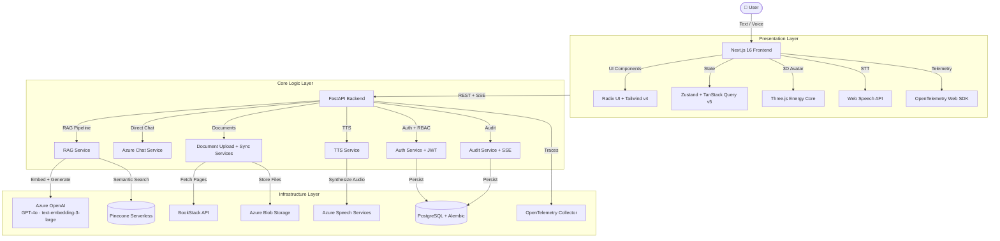
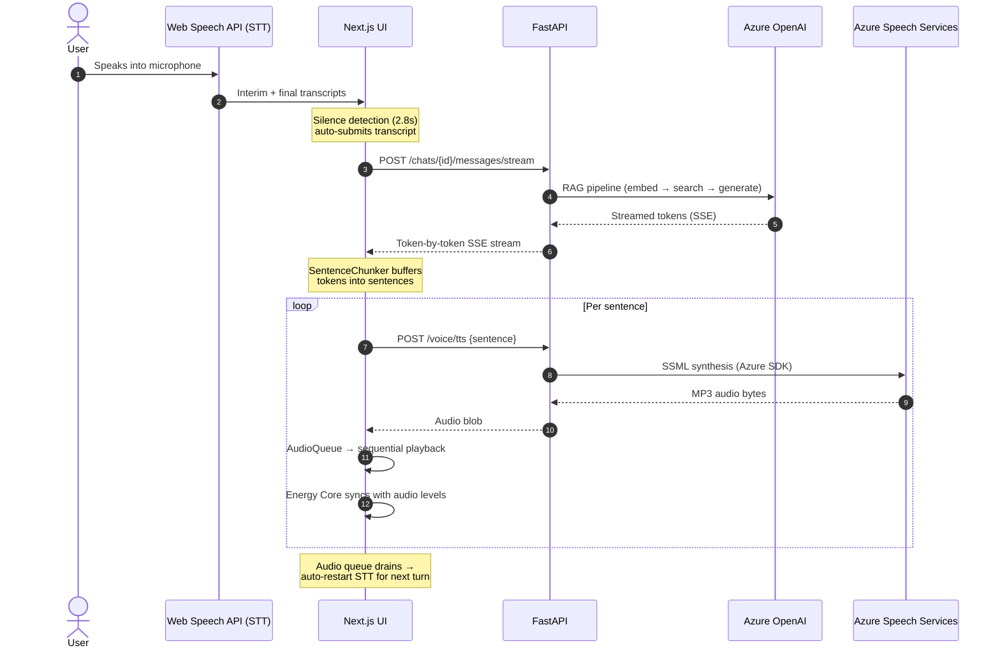
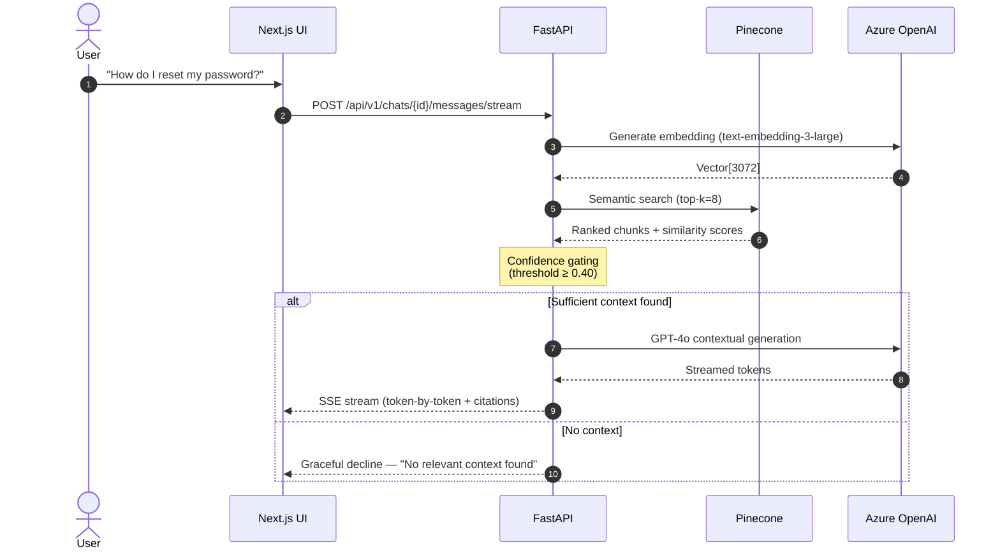

<p align="center">
  
  <br />
  
</p>

<p align="center">
  <em>Transforming static documentation into a dynamic, conversational AI experience.</em>
</p>

<p align="center">
  <a href="#-getting-started"></a>
  <a href="#-architecture"></a>
  <a href="#-api-reference"></a>
</p>

<p align="center">
  
  
  
  
  
  
  
  
  
</p>

---

## 💡 What is CLEO?

> **Static documentation kills productivity.** Users waste time digging through dense wikis instead of getting instant answers.

CLEO (**C**ontextual **L**earning & **E**nterprise **O**racle) is an **AI-powered enterprise assistant** that turns your knowledge base into an interactive, conversational experience. It uses a **Retrieval-Augmented Generation (RAG)** pipeline to pull accurate, cited answers from your BookStack wiki and user-uploaded documents — delivered via text or a full **voice-to-voice** pipeline.

### ✨ Key Capabilities

| | Feature | Description |
|:--|:--|:--|
| 🔍 | **RAG Chat** | Semantic search over your knowledge base with GPT-4o generation, confidence scoring, and tiered citations (primary, secondary, hidden) |
| 🗣️ | **Voice Pipeline** | Hybrid **Web Speech API** (STT) + **Azure Speech Services** (TTS) — speak a question, get a spoken answer with sentence-level streaming |
| 🧬 | **Energy Core Avatar** | Three.js neural visualization that pulses and breathes in sync with TTS audio levels during voice responses |
| 📄 | **Document Management** | Upload PDFs/Markdown → Azure Blob Storage → background chunking, embedding, and Pinecone indexing |
| 🔄 | **BookStack Sync** | Scheduled auto-sync, manual full/page sync, HMAC-verified webhook-driven real-time updates, and selective book/chapter/page filtering |
| 🔐 | **Auth & RBAC** | JWT authentication (register, login, refresh, logout, password reset) with role-based access control and per-endpoint permission checks |
| 📊 | **Audit Logging** | Event-based audit trail with real-time SSE streaming to the admin dashboard and historical log retrieval |
| 🛰️ | **Observability** | End-to-end OpenTelemetry distributed tracing (frontend fetch → backend → Pinecone → Azure) with structured JSON logging via Loguru |
| 🌐 | **Internationalization** | English & Spanish locale support via `next-intl` with locale-aware routing (`/en/...`, `/es/...`) |
| ⚡ | **Real-time Streaming** | SSE-powered token-by-token chat streaming for instant perceived response time |

---

## 🏗️ Architecture

CLEO follows **Clean Architecture** with strict dependency rules: business logic defines interfaces (ports), infrastructure implements them (adapters).



---

## 🗣️ Voice-to-Voice Pipeline

CLEO's voice mode uses a hybrid approach combining **browser-native speech recognition** with **server-side Azure neural TTS**, connected through a sentence-level streaming architecture:



**Key components:**
- **STTEngine** (`stt-engine.ts`) — Web Speech API wrapper with continuous mode, auto-restart on silence, and accumulated transcript management
- **SentenceChunker** (`sentence-chunker.ts`) — Buffers streaming tokens into complete sentences for natural TTS delivery
- **TTS Engine** (`tts-engine.ts`) — Calls `POST /voice/tts` (Azure Speech Services backend) with browser `SpeechSynthesis` as offline fallback
- **AudioQueue** (`audio-queue.ts`) — Sequential audio playback with real-time audio level analysis that drives the Energy Core visualization
- **useVoiceMode** (`useVoiceMode.ts`) — Master orchestrator coordinating the STT → RAG → TTS → playback lifecycle with automatic turn-taking

---

## 🔄 RAG Data Flow



---

## 📂 Project Structure

```
project-vanguard/
├── backend/
│   ├── app/
│   │   ├── adapters/              # External service clients
│   │   │   ├── azure_openai_client.py   # Azure OpenAI (generation)
│   │   │   ├── azure_speech_client.py   # Azure Speech TTS (SSML synthesis)
│   │   │   ├── azure_blob_storage.py    # Azure Blob (file uploads)
│   │   │   ├── bookstack_client.py      # BookStack REST API
│   │   │   ├── embedding_client.py      # Azure OpenAI embeddings
│   │   │   ├── llm_client.py            # LLM abstraction layer
│   │   │   ├── vector_store.py          # Pinecone vector operations
│   │   │   └── document_providers/      # Pluggable doc source providers
│   │   ├── api/                   # FastAPI routers
│   │   │   ├── router_auth.py           # Register, login, refresh, logout, password reset
│   │   │   ├── router_chat.py           # Stateless RAG chat (streaming + non-streaming)
│   │   │   ├── router_chats.py          # Persistent chat sessions (CRUD + streaming)
│   │   │   ├── router_documents.py      # Document upload and listing
│   │   │   ├── router_admin.py          # Sync triggers and status
│   │   │   ├── router_voice.py          # TTS synthesis endpoint
│   │   │   ├── router_azure_chat.py     # Direct Azure OpenAI chat
│   │   │   ├── router_bookstack.py      # BookStack sync config
│   │   │   ├── router_rbac.py           # Role and permission management
│   │   │   ├── router_system.py         # SSE audit stream + historical logs
│   │   │   ├── router_webhook.py        # BookStack webhook receiver (HMAC)
│   │   │   └── deps.py                  # Auth dependencies (JWT extraction, permission checks)
│   │   ├── core/                  # Config, security, middleware, telemetry, prompts
│   │   ├── db/                    # SQLAlchemy models + session management
│   │   ├── domain/                # Pydantic schemas + audit event definitions
│   │   ├── repositories/          # Data access layer
│   │   └── services/              # Business logic layer
│   │       ├── rag_service.py           # RAG orchestration (embed → search → generate)
│   │       ├── chat_service.py          # Persistent chat management + RAG integration
│   │       ├── auth_service.py          # JWT auth + password hashing (Argon2)
│   │       ├── rbac_service.py          # Role-based access control
│   │       ├── tts_service.py           # Azure TTS orchestration
│   │       ├── document_sync_service.py # BookStack sync (full/delta/webhook/scheduled)
│   │       ├── document_upload_service.py # PDF/Markdown upload + background indexing
│   │       ├── audit_service.py         # Event-based audit logging + SSE broadcast
│   │       ├── text_processor.py        # Recursive text chunking (800 tokens, 200 overlap)
│   │       ├── citation_ranker.py       # Tiered citation scoring
│   │       ├── sync_scheduler.py        # APScheduler auto-sync polling
│   │       └── azure_chat_service.py    # Direct Azure OpenAI generation
│   ├── alembic/               # Database migration scripts
│   ├── scripts/               # Utility scripts (ingestion, verification)
│   └── main.py                # Application entry point + health checks
│
├── frontend/
│   └── src/
│       ├── app/                   # Next.js App Router
│       │   └── [locale]/          # i18n pages (login, register, admin, documents)
│       ├── components/
│       │   ├── avatar/            # EnergyCoreCanvas (Three.js), AvatarPanel, AvatarControls
│       │   ├── chat/              # ChatPanel, MessageBubble, CitationList, ChatHistoryRail
│       │   ├── effects/           # ParticleCanvas, GhostTerminalOverlay, ScanlineOverlay
│       │   ├── layout/            # AppShell, TopBar, CleoInterface, SplitPanelLayout
│       │   ├── ui/                # Button, Dialog, Tooltip (Radix primitives)
│       │   └── voice/             # VoiceModeButton, VoiceTranscript, VoiceWaveform
│       ├── domains/               # Feature domains (DDD-style)
│       │   ├── auth/              # Auth API client, login/register components, auth store
│       │   ├── avatar/            # useAvatarState, useEnergyCoreState (audio → visual sync)
│       │   ├── chat/              # Chat store (Zustand), chat API client
│       │   ├── knowledge/         # Document library components
│       │   ├── system/            # Admin panel, sync controls, audit log viewer
│       │   └── voice/             # Voice engine (STT, TTS, SentenceChunker, AudioQueue)
│       │       ├── engine/        # stt-engine.ts, tts-engine.ts, sentence-chunker.ts, audio-queue.ts
│       │       ├── hooks/         # useVoiceMode, useSpeechRecognition, useAudioAnalyser
│       │       └── model/         # Voice store (Zustand) + types
│       ├── i18n/              # next-intl configuration
│       ├── messages/          # en.json + es.json locale files
│       └── styles/            # Global CSS + Tailwind theme
```

---

## 🛠️ Tech Stack

<details open>
<summary><strong>Backend — Python 3.13</strong></summary>

| Component | Technology | Purpose |
|:--|:--|:--|
| Framework | **FastAPI** + Uvicorn | Async API server |
| Database | **PostgreSQL** + SQLAlchemy 2.0 (asyncpg) | Relational persistence |
| Migrations | **Alembic** | Schema versioning |
| Auth | **PyJWT** + Argon2 (pwdlib) | JWT tokens + secure password hashing |
| AI Generation | **Azure OpenAI** (`gpt-4o-mini`) via LangChain | Conversational RAG generation |
| Embeddings | **Azure OpenAI** (`text-embedding-3-large`, 3072d) | Semantic vectorization |
| Vector Store | **Pinecone** (Serverless, AWS us-east-1) | Similarity search + upsert/delete |
| File Storage | **Azure Blob Storage** | User document uploads + SAS URLs |
| TTS | **Azure Speech Services** (Cognitive Services SDK) | Neural text-to-speech via SSML (MP3 output) |
| Sync Scheduling | **APScheduler** | Periodic BookStack auto-sync |
| Content Parsing | **BeautifulSoup4** + **pypdf** + **lxml** | HTML/PDF content extraction |
| Text Splitting | **LangChain Text Splitters** | Recursive chunking (800 tokens, 200 overlap) |
| Rate Limiting | **slowapi** | Per-IP request throttling |
| Observability | **OpenTelemetry** (FastAPI + httpx + SQLAlchemy instrumentation) | Distributed tracing |
| Logging | **Loguru** | Structured JSON logging |
| SSE | **sse-starlette** | Server-Sent Events for audit streaming |
| HTTP Client | **httpx** | Async external API calls (BookStack, etc.) |

</details>

<details open>
<summary><strong>Frontend — Next.js 16 (App Router)</strong></summary>

| Component | Technology | Purpose |
|:--|:--|:--|
| Framework | **Next.js 16** (App Router) + React 19 | Server/client rendering |
| Language | **TypeScript 5** | Type safety |
| Styling | **Tailwind CSS v4** | Utility-first CSS |
| UI Primitives | **Radix UI** (Dialog, Dropdown, Tooltip, VisuallyHidden) | Accessible headless components |
| Animation | **Framer Motion** | Page transitions + micro-interactions |
| 3D Visualization | **Three.js** | Energy Core neural avatar (audio-synced) |
| State (Client) | **Zustand** | Lightweight global state (chat, voice, auth, avatar stores) |
| State (Server) | **TanStack Query v5** | Data fetching + cache |
| i18n | **next-intl v4** | English/Spanish locale routing |
| Forms | **React Hook Form** + **Zod** | Schema-validated forms |
| Markdown | **react-markdown** + **remark-gfm** | Chat message rendering |
| Icons | **Lucide React** | Icon system |
| STT (Voice Input) | **Web Speech API** (`SpeechRecognition`) | Browser-native speech-to-text |
| TTS Fallback | **Web Speech API** (`SpeechSynthesis`) | Offline TTS when Azure is unavailable |
| Telemetry | **OpenTelemetry Web SDK** (fetch, XHR, document-load) | Frontend trace propagation (B3) |
| Testing | **Vitest** + **Testing Library** + **Istanbul** | Unit + coverage |
| Linting | **ESLint** + **Prettier** + **Husky** (pre-commit) | Code quality |

</details>

---

## 🔌 API Reference

<details>
<summary><strong>Authentication</strong> — <code>/api/v1/auth</code></summary>

| Method | Endpoint | Description |
|:--|:--|:--|
| `POST` | `/register` | Create account (auto-assigns default role) |
| `POST` | `/login` | Email/password → JWT access + refresh tokens |
| `POST` | `/refresh` | Rotate access token with refresh token |
| `POST` | `/logout` | Revoke refresh token |
| `POST` | `/forgot-password` | Request password reset code |
| `POST` | `/reset-password` | Confirm reset with code |
| `GET` | `/me` | Current user profile + roles + permissions |

</details>

<details>
<summary><strong>Persistent Chat Sessions</strong> — <code>/api/v1/chats</code></summary>

| Method | Endpoint | Description | Auth |
|:--|:--|:--|:--|
| `POST` | `/` | Create new chat session | `chat:use` |
| `GET` | `/` | List user's chat sessions (paginated) | `chat:use` |
| `GET` | `/{chat_id}/messages` | Fetch paginated messages (cursor-based) | `chat:use` |
| `POST` | `/{chat_id}/messages` | Send message → RAG response | `chat:use` |
| `POST` | `/{chat_id}/messages/stream` | Send message → SSE streaming response | `chat:use` |
| `DELETE` | `/{chat_id}` | Soft-delete a chat session | `chat:use` |

</details>

<details>
<summary><strong>Stateless RAG Chat</strong> — <code>/api/v1/chat</code></summary>

| Method | Endpoint | Description |
|:--|:--|:--|
| `POST` | `/` | One-shot RAG query (non-streaming) |
| `POST` | `/stream` | One-shot RAG query (SSE streaming) |

</details>

<details>
<summary><strong>Azure Direct Chat</strong> — <code>/api/v1/azure-chat</code></summary>

| Method | Endpoint | Description |
|:--|:--|:--|
| `POST` | `/` | Stateless prompt + context → Azure OpenAI generation |

</details>

<details>
<summary><strong>Voice (TTS)</strong> — <code>/api/v1/voice</code></summary>

| Method | Endpoint | Description |
|:--|:--|:--|
| `POST` | `/tts` | Text-to-speech via Azure Speech Services (streaming or full MP3) |
| `GET` | `/voices` | Get configured voice name, format, and region |

</details>

<details>
<summary><strong>Documents</strong> — <code>/api/v1/documents</code></summary>

| Method | Endpoint | Description |
|:--|:--|:--|
| `POST` | `/upload` | Upload PDF/Markdown → Blob → background chunking + indexing |
| `GET` | `/` | List user's uploaded documents |

</details>

<details>
<summary><strong>Admin & Sync</strong> — <code>/api/v1/admin</code></summary>

| Method | Endpoint | Description |
|:--|:--|:--|
| `POST` | `/ingest` | Trigger full BookStack → Pinecone sync |
| `POST` | `/ingest/{page_id}` | Re-ingest a single page by external ID |
| `GET` | `/sync/status` | Sync status + indexed pages + vector chunks |

</details>

<details>
<summary><strong>System (Audit)</strong> — <code>/api/v1/system</code></summary>

| Method | Endpoint | Description |
|:--|:--|:--|
| `GET` | `/events` | SSE stream for real-time audit events |
| `GET` | `/logs` | Fetch historical audit logs (requires `system.view_audit_logs`) |

</details>

<details>
<summary><strong>Webhooks</strong> — <code>/api/v1/webhook</code></summary>

| Method | Endpoint | Description |
|:--|:--|:--|
| `POST` | `/bookstack` | HMAC-SHA256 verified BookStack page events (create/update/delete) |

</details>

<details>
<summary><strong>Health</strong></summary>

| Method | Endpoint | Description |
|:--|:--|:--|
| `GET` | `/health` | Basic liveness probe |
| `GET` | `/health/detailed` | Upstream service checks (Pinecone, BookStack, Azure, Postgres) |

</details>

---

## 🚀 Getting Started

### Prerequisites

- **Python 3.13+** with pip
- **Node.js 20+** with npm 10+
- **PostgreSQL 16+** running locally or remotely
- API keys for: Azure OpenAI, Pinecone, BookStack, Azure Blob Storage, Azure Speech Services

### 1. Clone

```bash
git clone https://github.com/AbhayKauts21/Vanguard.git
cd Vanguard
```

### 2. Backend

```bash
cd backend
python -m venv venv && source venv/bin/activate
pip install -r requirements.txt
cp .env.example .env          # ← Fill in all required keys
alembic upgrade head          # Run database migrations
python main.py                # Starts FastAPI on http://localhost:8000
```

### 3. Frontend

```bash
cd frontend
npm install
cp .env.example .env.local    # ← Set NEXT_PUBLIC_API_BASE_URL
npm run dev                   # Starts Next.js on http://localhost:3000
```

### 4. Run Tests

```bash
# Frontend unit tests
cd frontend && npx vitest run

# Frontend with coverage
cd frontend && npx vitest run --coverage

# Backend unit tests
cd backend && pytest
```

---

## ⚙️ Configuration

<details>
<summary><strong>Backend Environment Variables</strong></summary>

| Variable | Description |
|:--|:--|
| **Azure OpenAI** | |
| `AZURE_OPENAI_ENDPOINT` | Resource endpoint (`https://your-resource.openai.azure.com`) |
| `AZURE_OPENAI_API_KEY` | API key |
| `AZURE_OPENAI_API_VERSION` | API version string |
| `AZURE_OPENAI_CHAT_DEPLOYMENT` | Deployment name for GPT-4o generation |
| `AZURE_OPENAI_EMBEDDING_DEPLOYMENT` | Deployment name for text-embedding-3-large |
| `EMBEDDING_DIMENSIONS` | Vector dimensions (default: `3072`) |
| **Pinecone** | |
| `PINECONE_API_KEY` | API key |
| `PINECONE_INDEX_NAME` | Index name (default: `cleo-docs`) |
| `PINECONE_CLOUD` | Cloud provider (default: `aws`) |
| `PINECONE_REGION` | Region (default: `us-east-1`) |
| `DOCUMENT_VECTOR_NAMESPACE` | Namespace (default: `bookstack`) |
| **BookStack** | |
| `BOOKSTACK_URL` | Instance URL |
| `BOOKSTACK_TOKEN_ID` | API token ID |
| `BOOKSTACK_TOKEN_SECRET` | API token secret |
| `BOOKSTACK_WEBHOOK_SECRET` | HMAC secret for webhook verification |
| **Azure Blob Storage** | |
| `AZURE_BLOB_CONNECTION_STRING` | Connection string (preferred) |
| `AZURE_BLOB_ACCOUNT_URL` | Account URL (if not using connection string) |
| `AZURE_BLOB_ACCOUNT_NAME` | Account name for SAS generation |
| `AZURE_BLOB_ACCOUNT_KEY` | Account key for uploads |
| `AZURE_BLOB_CONTAINER_NAME` | Container name (default: `cleo-user-documents`) |
| `DOCUMENT_UPLOAD_MAX_BYTES` | Max upload size (default: 20MB) |
| **Azure Speech Services** | |
| `AZURE_SPEECH_KEY` | Speech Services API key |
| `AZURE_SPEECH_REGION` | Region (default: `eastus`) |
| `AZURE_TTS_VOICE` | Neural voice name (default: `en-US-JennyNeural`) |
| `AZURE_TTS_OUTPUT_FORMAT` | Audio format (default: `audio-24khz-48kbitrate-mono-mp3`) |
| **PostgreSQL** | |
| `POSTGRES_HOST` | Database host (default: `127.0.0.1`) |
| `POSTGRES_PORT` | Database port (default: `5432`) |
| `POSTGRES_DB` | Database name |
| `POSTGRES_USER` | Database user |
| `POSTGRES_PASSWORD` | Database password |
| **JWT / Security** | |
| `JWT_SECRET_KEY` | Secret for signing JWTs |
| `JWT_ACCESS_TOKEN_EXPIRE_MINUTES` | Access token TTL (default: `30`) |
| `JWT_REFRESH_TOKEN_EXPIRE_DAYS` | Refresh token TTL (default: `14`) |
| `AUTH_DEFAULT_ROLE` | Default role for new users (default: `viewer`) |
| `ALLOWED_ORIGINS` | CORS origins (comma-separated) |
| `RATE_LIMIT_PER_MINUTE` | API rate limit (default: `30`) |
| **Ingestion Tuning** | |
| `CHUNK_SIZE` | Text chunk size (default: `800`) |
| `CHUNK_OVERLAP` | Chunk overlap (default: `200`) |
| `MIN_SIMILARITY_SCORE` | Confidence threshold (default: `0.40`) |
| `SYNC_INTERVAL_MINUTES` | Auto-sync interval (default: `5`) |
| `TOP_K_RESULTS` | Vectors retrieved per query (default: `8`) |

</details>

<details>
<summary><strong>Frontend Environment Variables</strong></summary>

| Variable | Description |
|:--|:--|
| `NEXT_PUBLIC_API_BASE_URL` | Backend URL (default: `http://localhost:8000`) |
| `NEXT_PUBLIC_ENABLE_STREAMING` | Enable SSE chat streaming (`true`/`false`) |
| `NEXT_PUBLIC_ENABLE_AMBIENT_EFFECTS` | Enable particle/scanline effects (`true`/`false`) |
| `NEXT_PUBLIC_ENABLE_TTS_FALLBACK` | Enable browser TTS fallback when Azure TTS fails (`true`/`false`) |

</details>

---

## 📊 Audit Event Registry

CLEO tracks all critical user and system actions via typed event codes:

| Code Range | Category | Events |
|:--|:--|:--|
| `1xxx` | **Identity & Access** | `USER_LOGGED_IN`, `USER_LOGGED_OUT`, `USER_ROLES_UPDATED`, `PASSWORD_RESET_REQUESTED` |
| `2xxx` | **Documents** | `DOC_UPLOADED`, `DOC_DELETED`, `DOC_REINDEXED`, `DOC_PROCESSING_FAILED`, `DOC_READY` |
| `3xxx` | **Conversations** | `CHAT_STARTED`, `CHAT_DELETED`, `CHAT_TITLED` |
| `4xxx` | **System & Sync** | `SYNC_TRIGGERED`, `SYNC_COMPLETED`, `SYNC_FAILED`, `SYNC_SCOPE_UPDATED` |
| `9xxx` | **Security** | `UNAUTHORIZED_ACCESS_ATTEMPT`, `SYSTEM_ERROR_CRITICAL` |

---

<p align="center">
  <sub>Built with ❤️ by <strong>Team Vanguard</strong> for the Andino Global AI Hackathon</sub>
</p>
