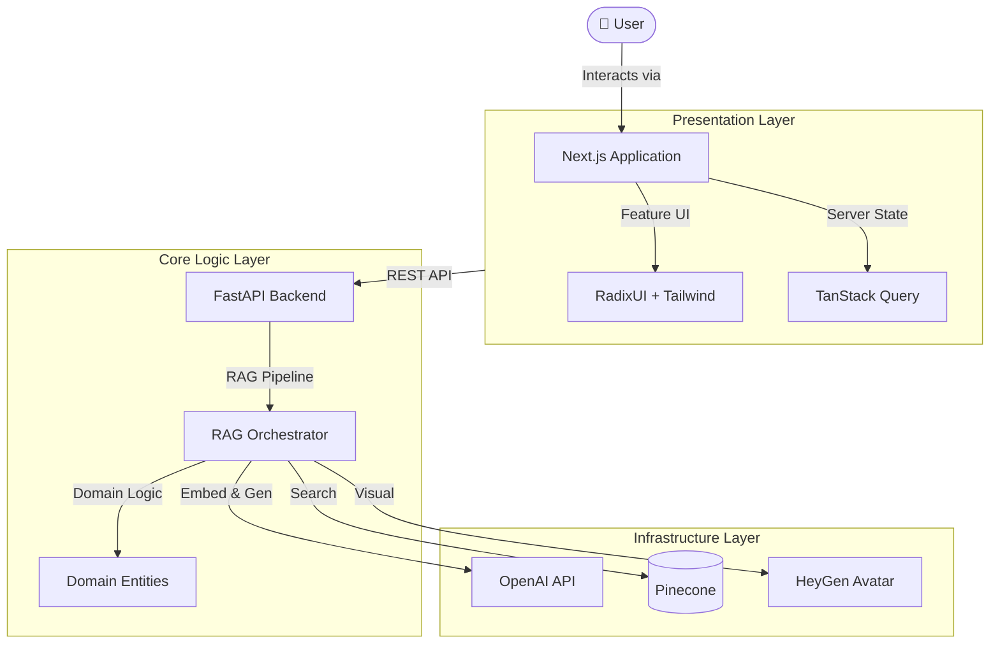
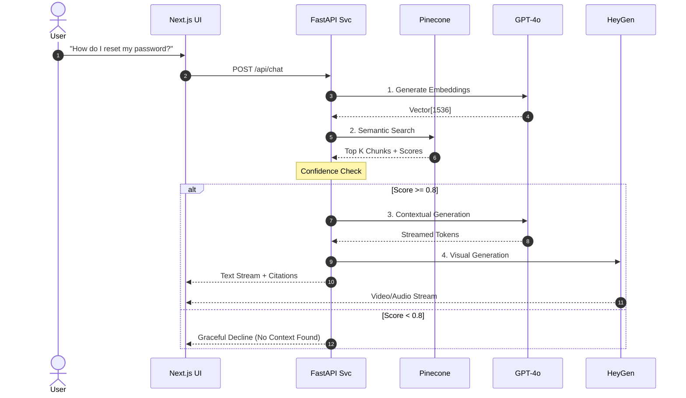

<div align="center">

# 🧠 CLEO
**Contextual Learning & Enterprise Oracle**

*The Future of Interactive Customer Support — built by Team Vanguard*

[](https://github.com/AbhayKauts21/Vanguard)
[](#)
[](#)
[](#)
[](#)

*Transforming static documentation into a dynamic, conversational AI experience.*

[Architecture Deep Dive](docs/designs/hld_diagram.mmd) • [Data Flow](docs/data-flow/data_flow.md) • [RAG Concepts](docs/basic_concepts/RAG-VectorDB.md)

</div>

---

## 💡 The Problem & Our Solution
> **Static documentation often leads to support tickets even for common questions.** 
CLEO eliminates the friction of digging through dense wikis. We built an AI-powered avatar assistant that interacts with users naturally (via text or voice) and utilizes a **Retrieval-Augmented Generation (RAG)** pipeline to pull highly accurate troubleshooting steps directly from our BookStack knowledge repository.

---

## 🏗️ High-Level Architecture
CLEO is built on **Clean Architecture** and **Domain-Driven Design (DDD)** principles, ensuring that our AI logic is decoupled from external APIs and infrastructure.



---

## 🔄 Interactive Data Flow
When a user asks a question, the system orchestrates a multi-stage RAG pipeline to ensure accuracy and prevent hallucinations.



---

## 🛠️ Core Technology Stack

| Layer | Technology | Role |
| :--- | :--- | :--- |
| **Frontend** | React 19, Tailwind CSS | UI/UX & Responsive Design |
| **Backend** | Python, Flask / FastAPI | API Gateway & RAG Orchestration |
| **AI Generation** | OpenAI `gpt-4o` | Conversational Intelligence |
| **Embeddings** | `text-embedding-3-small` | Semantic Vectorization |
| **Vector Store** | Pinecone (Serverless) | Knowledge Storage & Similarity Search |
| **AV Avatar** | HeyGen Interactive API | Life-like Visual Interaction |
| **Observability** | OpenTelemetry | Distributed Tracing & Performance |

---

## 📜 Architectural Principles
We follow production-grade standards inspired by the **Checkingmate** ecosystem:
- **Clean Architecture:** Strict separation between business rules (RAG logic) and infrastructure (OpenAI/Pinecone).
- **Fail-Fast Error Handling:** Standardized error responses to prevent internal leaks.
- **Dependency Injection:** Making our services swapable and testable.
- **Observability First:** Distributed tracing from the UI to the Vector DB.

---

## 🚀 Getting Started

1. **Clone the repository:**
   ```bash
   git clone https://github.com/AbhayKauts21/Vanguard.git
   ```
2. **Setup Backend:**
   ```bash
   cd backend
   pip install -r requirements.txt
   cp .env.example .env # Fill in your API keys
   python main.py
   ```
3. **Setup Frontend:**
   ```bash
   cd frontend
   npm install
   npm run dev
   ```

---

<p align="center">Built with ❤️ for the Andino Global AI Hackathon</p>