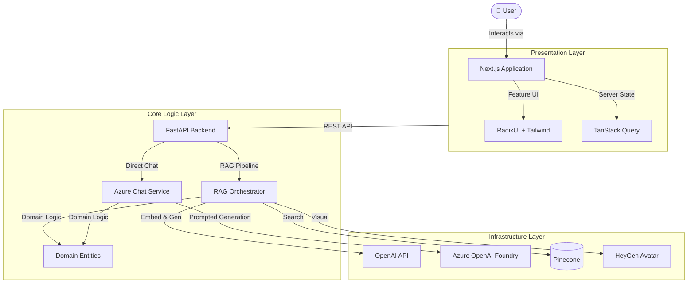
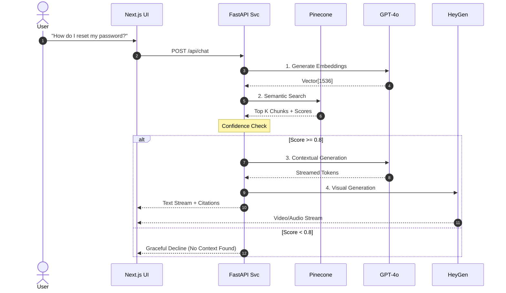

<div align="center">

# 🧠 CLEO
**Contextual Learning & Enterprise Oracle**

*The Future of Interactive Customer Support — built by Team Vanguard*

[](https://github.com/AbhayKauts21/Vanguard)
[](#)
[](#)
[](#)
[](#)

*Transforming static documentation into a dynamic, conversational AI experience.*

[Architecture Deep Dive](docs/designs/hld_diagram.mmd) • [Data Flow](docs/data-flow/data_flow.md) • [RAG Concepts](docs/basic_concepts/RAG-VectorDB.md)

</div>

---

## 💡 The Problem & Our Solution
> **Static documentation often leads to support tickets even for common questions.** 
CLEO eliminates the friction of digging through dense wikis. We built an AI-powered avatar assistant that interacts with users naturally (via text or voice) and utilizes a **Retrieval-Augmented Generation (RAG)** pipeline to pull highly accurate troubleshooting steps directly from our BookStack knowledge repository.

---

## 🏗️ High-Level Architecture
CLEO is built on **Clean Architecture** and **Domain-Driven Design (DDD)** principles, ensuring that our AI logic is decoupled from external APIs and infrastructure.



---

## 🔄 Interactive Data Flow
When a user asks a question, the system orchestrates a multi-stage RAG pipeline to ensure accuracy and prevent hallucinations.



---

## 🛠️ Core Technology Stack

| Layer | Technology | Role |
| :--- | :--- | :--- |
| **Frontend** | Next.js 16 (App Router), TypeScript, Tailwind CSS v4 | Neural-themed UI with i18n |
| **State** | Zustand, TanStack Query v5 | Client & server state management |
| **UI Library** | Radix UI, Framer Motion, CVA | Accessible components & animation |
| **i18n** | next-intl v4 | English / Spanish locale routing |
| **Backend** | Python 3.13, FastAPI | API Gateway & RAG Orchestration |
| **AI Generation** | OpenAI `gpt-4o-mini` | Conversational Intelligence |
| **Embeddings** | `text-embedding-3-small` | Semantic Vectorization |
| **Vector Store** | Pinecone (Serverless) | Knowledge Storage & Similarity Search |
| **AV Avatar** | HeyGen Interactive API | Life-like Visual Interaction |
| **Testing** | Vitest, Istanbul, Testing Library | Unit & integration coverage |

---

## 📜 Architectural Principles
We follow production-grade standards inspired by the **Checkingmate** ecosystem:
- **Clean Architecture:** Strict separation between business rules (RAG logic) and infrastructure (OpenAI/Pinecone).
- **Fail-Fast Error Handling:** Standardized error responses to prevent internal leaks.
- **Dependency Injection:** Making our services swapable and testable.
- **Observability First:** Distributed tracing from the UI to the Vector DB.

---

## 🔌 Backend APIs

The backend currently exposes two different chat paths:

- `POST /api/v1/chat/` and `POST /api/v1/chat/stream`
  RAG-backed chat using BookStack context from Pinecone plus the existing OpenAI generation path.
- `POST /api/v1/azure-chat/`
  Direct Azure OpenAI Foundry chat for stateless prompt + context requests.

### Azure Direct Chat Request

```json
{
  "conversation_id": "conv-001",
  "prompt": "Summarize this issue for an engineering handoff.",
  "input_text": "User cannot authenticate with SSO after password reset.",
  "context": {
    "priority": "high",
    "product": "Vanguard"
  },
  "params": {
    "temperature": 0.2,
    "max_tokens": 250
  },
  "metadata": {
    "source": "manual-test"
  }
}
```

### Azure Setup Notes

- Set Azure values in [`backend/.env.example`](backend/.env.example) and copy them into `backend/.env`.
- `AZURE_OPENAI_ENDPOINT` must be the resource endpoint only, such as `https://your-resource.openai.azure.com`.
- `AZURE_OPENAI_CHAT_DEPLOYMENT` must be the Azure deployment name, not just the raw model family.
- The smoke-test script is available at `backend/scripts/test_azure_chat.py`.

---

## 🚀 Getting Started

### Prerequisites
- **Python 3.13+** and **pip**
- **Node.js 20+** and **npm 10+**
- API keys for OpenAI, Pinecone, and BookStack

### 1. Clone the repository
```bash
git clone https://github.com/AbhayKauts21/Vanguard.git
cd Vanguard
```

### 2. Backend
```bash
cd backend
pip install -r requirements.txt
cp .env.example .env   # fill in your API keys
python main.py         # starts FastAPI on http://localhost:8000
```

### 3. Frontend
```bash
cd frontend
npm install
cp .env.example .env.local  # set NEXT_PUBLIC_API_BASE_URL
npm run dev                  # starts Next.js on http://localhost:3000
```

### 4. Run Tests
```bash
cd frontend && npx vitest run       # unit tests
cd frontend && npx vitest --coverage # with istanbul coverage
```

### Environment Variables

| Variable | Where | Description |
| :--- | :--- | :--- |
| `OPENAI_API_KEY` | Backend | OpenAI API key |
| `PINECONE_API_KEY` | Backend | Pinecone API key |
| `BOOKSTACK_BASE_URL` | Backend | BookStack instance URL |
| `BOOKSTACK_TOKEN_ID` | Backend | BookStack API token ID |
| `BOOKSTACK_TOKEN_SECRET` | Backend | BookStack API token secret |
| `NEXT_PUBLIC_API_BASE_URL` | Frontend | Backend URL (default `http://localhost:8000`) |
| `NEXT_PUBLIC_ENABLE_STREAMING` | Frontend | Enable SSE streaming (`true`/`false`) |
| `NEXT_PUBLIC_ENABLE_AMBIENT_EFFECTS` | Frontend | Enable particle/scanline effects (`true`/`false`) |

---

<p align="center">Built with ❤️ for the Andino Global AI Hackathon</p>
